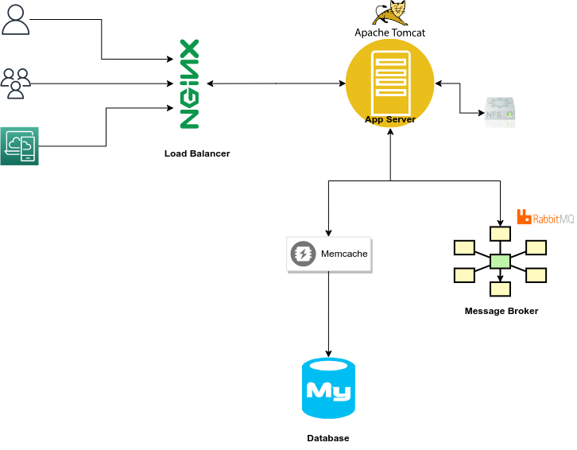
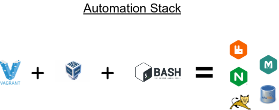
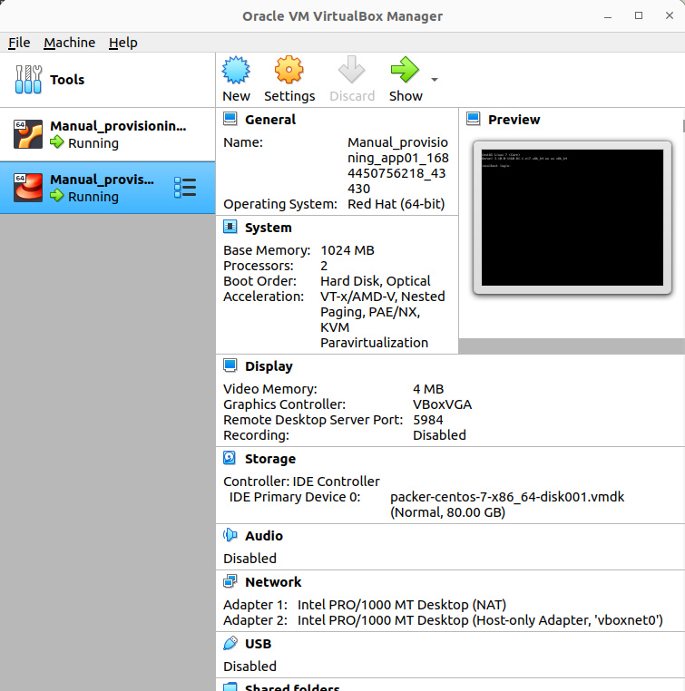
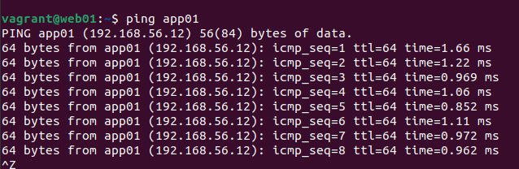
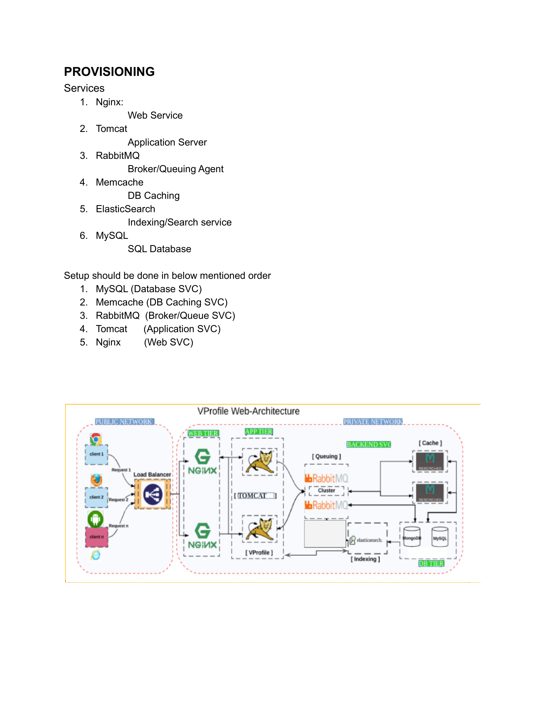
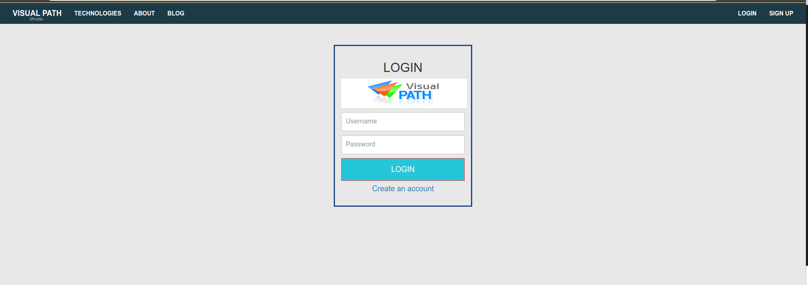
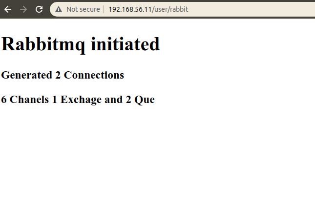
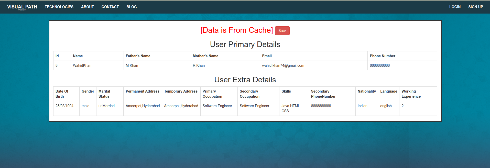
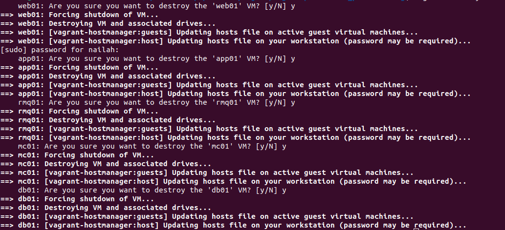

# Project 1 : Set up a Multi-tier Web App Stack Locally

In this project, we will learn to set up a multi-tier Web App Locally.  This project is originally created by Imran Teli and can be found [here](https://www.udemy.com/course/devopsprojects/?src=sac&kw=devops+projects)

**Objective**
At the end of this project, I learned how to 
- Setup VM Automation Locally
- Setup a real world project on my local machine for R & D

## Prerequisites
Before beginning, Install the following

* Hypervisor - Oracle VM Box
* Vagrant
* Git
* Maven
* jdk8
* awscli
* An IDE of your choice, I use VSCode

Next clone the git repository

```https://github.com/nneyen/vprofile-project.git
```

## Architecture
- This first architecture (redrawn from original) shows the general overview of the project. Whenever you begin any project, it is important to understand the flow of the stack


**Key things to note**: 
- This application in Developed in Java, hence we will use Tomcat as our webapp service
- NFS is external storage ( this is not implement in this current execution)
- NGINX creates a load balancer experience 
- Memcache provides caching for database
- MySQL hold log in details
- RabbitMQ is the message broker

- Next is the Architecture for the Automation Stack


**The Flow of Execution is as Follows**
 - clone source code 
 - cd into the vargrant dir
 - bring up VM's using vagrant file
 - validate all VMs
 - Setup all services
 - Build and Deploy Application
 - Verify


## Step 1 : Setup VM

In this step we are going to bring up all VMs using the ` vagrant up ` command. 

*Vagrant allows to create and configure virtual environments, which are essentially isolated software systems running on your computer.* 

- first we will go to the directory where the vagrant file exists the file name is vagrantFile

- next install the vagrant plug in using the command 
```
vagrant plugin install vagrant-hostmanager
```
- then you can run the command to bring up the VMs
```
vagrant up
```
After a few minutes, you can check to see if your VMs are running. This usually takes a while so you have to be patient. It should look like this when it is up and running : 




* Next we will verify that our VMS by pinging each one. To do that, we will ssh into each VM using this command `vagrant ssh <vm_name>`. The VM name is in the VagrantFile

*Because of the plug in we installed earlier, all the vm hostnames and `/etc/hosts` will be automaticall updated. To confirm run the command `cat /etc/hosts`*

```
vagrant ssh web01
```
* ping app01 from web01 using the command `ping app01`. Remember that according to the diagram, Web tier communicates with the app tier


* now we have confirmed that they are connected, we can logout using the `logout` command

* Repeat this for the app01 vm, first ssh into `app01`, and then check its connectivity to the backend servers `rmq01`, `db01` and `mc01`. Remember to logout once you have confirmed connectivity. 

## Step 2: Provisioning Services


* We will now provision 6 services in total and in the order mentioned below: In this order we are setting up backend services first and then the application service and then web service last

|Service|Description|
|-------|-----------|
|MySQL | Database Service|
|Memcache| DB Caching Service|
|Rabbit MQ| Messaging Brokering Agent|
|Tomcat| Application Service|
|Nginx| Web Service |

### Step 2a : Provisioning MySQL (Database SVC)
- ssh to the database vm using the command `vagrant ssh db01`
- follow the steps found in this setup file [mysql.md](setup/mysql.md)
### Step 2b : Provisioning Memcache (Db Caching SVC)
- ssh to the memcache vm using the command `vagrant ssh mc01`
- follow the steps found in this setup file [memcache.md](setup/memcache.md)

### Step 2c : Provisioning RabbitMQ (Message Brokering SVC)
- ssh to the rabbitmq vm using the command `vagrant ssh rmq01`
- follow the steps found in this setup file [rabbitmq.md](setup/rabbitmq.md)

We are done with setting up our backend let's move to the app setup
### Step 2c : Provisioning Tomcat (App SVC)
- ssh to the tomcat vm using the command `vagrant ssh app01`
- follow the steps found in this setup file [tomcat.md](setup/tomcat.md)

Finally we setup our load balancer
### Step 2d: Provisioning NGINX ( Web SVC)
- ssh to the web server vm using the command `vagrant ssh web01`
- follow the steps found in this setup file [nginx.md](setup/nginx.md)

# Step 3 : Verify Website from Browser
We are going to validate our website from the browser
- first in `web01` run `ifconfig` to get the IP address of web01
- Check that NGINX is running on your browser using the url `http://<IP_of_web01>`. This page should come up:

- Check database validation by signing in using the credentials `admin_vp` for both username and password
- Validate that your app is running on Tomcat

- Click on RabbitMQ to validate it

- Click on all users to validate data coming in from cache


At this point, I think we have completed the project. You can go ahead and destroy all your beautiful work

# Step 4 : Cleanup
To clean up simply navigate out of `web01` into the `Manual_Provisioning` folder and then run the command
```
vagrant destroy
```

This should take a while but all of the resources will be pulled down. Well done. 


