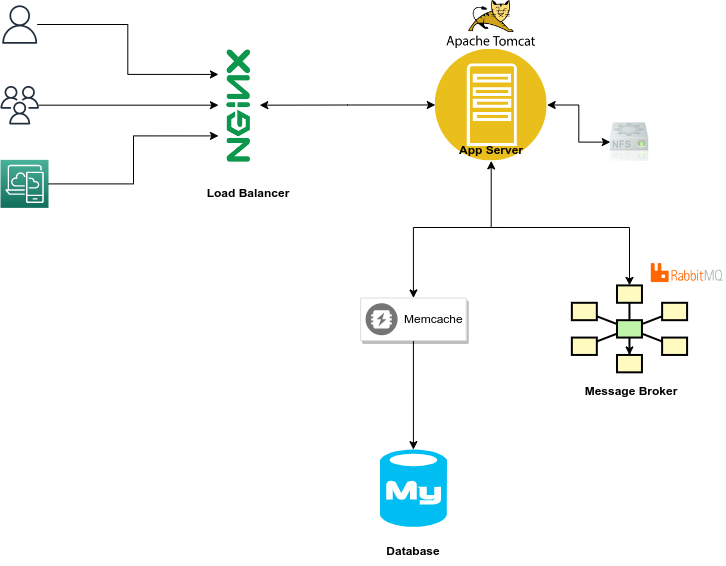
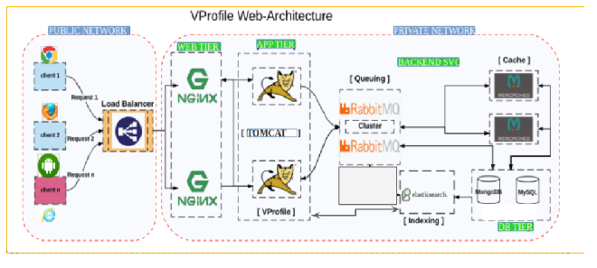

# Project 2 : Automate setting up a Local Multi-tier Web App Stack

This project is the second project in the [20 DevOps project](https://www.udemy.com/course/devopsprojects/?src=sac&kw=devops+projects) series created by Imran Teli.

** Objectives**
At the end of this project, I learned how to:
- Automate the deployment of a Multi-tier Web App using Vagrant

## Prerequisite
Before you begin, ensure you have gone through Project 1 (Set up a Multi - tier Web App Stack Locally)


Clone the repository here :

```
https://github.com/nneyen/vprofile-project.git
```
## Architecture 
Below we have two architecture diagrams that show the flow of the stack for the project itself and the automation stack



## Step 1 : Lets set up our bash scripts for our services

### Database Service 
- create a file titled ``mysql.sh`` and copy the following script into it 
```
#!/bin/bash
DATABASE_PASS='admin123'
sudo yum update -y
sudo yum install epel-release -y
sudo yum install git zip unzip -y
sudo yum install mariadb-server -y


# starting & enabling mariadb-server
sudo systemctl start mariadb
sudo systemctl enable mariadb
cd /tmp/
git clone -b local-setup https://github.com/devopshydclub/vprofile-project.git
#restore the dump file for the application
sudo mysqladmin -u root password "$DATABASE_PASS"
sudo mysql -u root -p"$DATABASE_PASS" -e "UPDATE mysql.user SET Password=PASSWORD('$DATABASE_PASS') WHERE User='root'"
sudo mysql -u root -p"$DATABASE_PASS" -e "DELETE FROM mysql.user WHERE User='root' AND Host NOT IN ('localhost', '127.0.0.1', '::1')"
sudo mysql -u root -p"$DATABASE_PASS" -e "DELETE FROM mysql.user WHERE User=''"
sudo mysql -u root -p"$DATABASE_PASS" -e "DELETE FROM mysql.db WHERE Db='test' OR Db='test\_%'"
sudo mysql -u root -p"$DATABASE_PASS" -e "FLUSH PRIVILEGES"
sudo mysql -u root -p"$DATABASE_PASS" -e "create database accounts"
sudo mysql -u root -p"$DATABASE_PASS" -e "grant all privileges on accounts.* TO 'admin'@'localhost' identified by 'admin123'"
sudo mysql -u root -p"$DATABASE_PASS" -e "grant all privileges on accounts.* TO 'admin'@'%' identified by 'admin123'"
sudo mysql -u root -p"$DATABASE_PASS" accounts < /tmp/vprofile-project/src/main/resources/db_backup.sql
sudo mysql -u root -p"$DATABASE_PASS" -e "FLUSH PRIVILEGES"

# Restart mariadb-server
sudo systemctl restart mariadb


#starting the firewall and allowing the mariadb to access from port no. 3306
sudo systemctl start firewalld
sudo systemctl enable firewalld
sudo firewall-cmd --get-active-zones
sudo firewall-cmd --zone=public --add-port=3306/tcp --permanent
sudo firewall-cmd --reload
sudo systemctl restart mariadb

```
### Memcache Service
- create a file titled ``memcache.sh`` and copy the following scripts into it
```
#!/bin/bash
sudo yum install epel-release -y
sudo yum install memcached -y
sudo systemctl start memcached
sudo systemctl enable memcached
sudo systemctl status memcached
sudo memcached -p 11211 -U 11111 -u memcached -d
```

### Rabbit MQ Service
- create a file titled ``rabbitmq.sh`` and copy the following scripts into it
```
#!/bin/bash
sudo yum install epel-release -y
sudo yum update -y
sudo yum install wget -y
cd /tmp/
wget http://packages.erlang-solutions.com/erlang-solutions-2.0-1.noarch.rpm
sudo rpm -Uvh erlang-solutions-2.0-1.noarch.rpm
sudo yum -y install erlang socat
curl -s https://packagecloud.io/install/repositories/rabbitmq/rabbitmq-server/script.rpm.sh | sudo bash
sudo yum install rabbitmq-server -y
sudo systemctl start rabbitmq-server
sudo systemctl enable rabbitmq-server
sudo systemctl status rabbitmq-server
sudo sh -c 'echo "[{rabbit, [{loopback_users, []}]}]." > /etc/rabbitmq/rabbitmq.config'
sudo rabbitmqctl add_user test test
sudo rabbitmqctl set_user_tags test administrator
sudo systemctl restart rabbitmq-server
```
### Tomcat Services
- create a file titled ``tomcat.sh`` and copy the following scripts into it
```
TOMURL="https://archive.apache.org/dist/tomcat/tomcat-8/v8.5.37/bin/apache-tomcat-8.5.37.tar.gz"
yum install java-1.8.0-openjdk -y
yum install git maven wget -y
cd /tmp/
wget $TOMURL -O tomcatbin.tar.gz
EXTOUT=`tar xzvf tomcatbin.tar.gz`
TOMDIR=`echo $EXTOUT | cut -d '/' -f1`
useradd --shell /sbin/nologin tomcat
rsync -avzh /tmp/$TOMDIR/ /usr/local/tomcat8/
chown -R tomcat.tomcat /usr/local/tomcat8

rm -rf /etc/systemd/system/tomcat.service

cat <<EOT>> /etc/systemd/system/tomcat.service
[Unit]
Description=Tomcat
After=network.target

[Service]

User=tomcat
Group=tomcat

WorkingDirectory=/usr/local/tomcat8

#Environment=JRE_HOME=/usr/lib/jvm/jre
Environment=JAVA_HOME=/usr/lib/jvm/jre

Environment=CATALINA_PID=/var/tomcat/%i/run/tomcat.pid
Environment=CATALINA_HOME=/usr/local/tomcat8
Environment=CATALINE_BASE=/usr/local/tomcat8

ExecStart=/usr/local/tomcat8/bin/catalina.sh run
ExecStop=/usr/local/tomcat8/bin/shutdown.sh


RestartSec=10
Restart=always

[Install]
WantedBy=multi-user.target

EOT

systemctl daemon-reload
systemctl start tomcat
systemctl enable tomcat

git clone -b local-setup https://github.com/devopshydclub/vprofile-project.git
cd vprofile-project
mvn install
systemctl stop tomcat
sleep 60
rm -rf /usr/local/tomcat8/webapps/ROOT*
cp target/vprofile-v2.war /usr/local/tomcat8/webapps/ROOT.war
systemctl start tomcat
sleep 120
cp /vagrant/application.properties /usr/local/tomcat8/webapps/ROOT/WEB-INF/classes/application.properties
systemctl restart tomcat
```
### Nginx Services
- create a file titled ``nginx.sh`` and copy the following scripts into it

```
# adding repository and installing nginx		
apt update
apt install nginx -y
cat <<EOT > vproapp
upstream vproapp {

 server app01:8080;

}

server {

  listen 80;

location / {

  proxy_pass http://vproapp;

}

}

EOT

mv vproapp /etc/nginx/sites-available/vproapp
rm -rf /etc/nginx/sites-enabled/default
ln -s /etc/nginx/sites-available/vproapp /etc/nginx/sites-enabled/vproapp

#starting nginx service and firewall
systemctl start nginx
systemctl enable nginx
systemctl restart nginx
```

## Step 2 : We will spin up our architecture
- go to the repository (Automated_Provisioning) and navigate to the folder that contains the vagrant file
run the following commands one at a time
```
vagrant plugin install vagrant-hostmanager
vagrant up
```
Now watch the magic of automation happen

NOTE: Remember to Validate your applications from the browser

Here are a few more commands you can run 
- to stop the VM without destroying run ``vagrant halt ``
- to restart the VM run ``vagrant up``
- to check the status of your VMs run ``vagrant status``
- to tear down the entire infrastrucutre run ``vagrant destroy``


